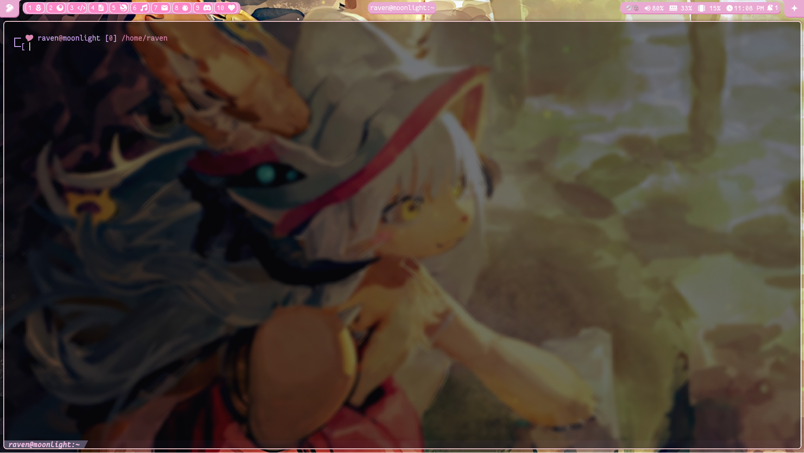

# ⚠️ Project is still a work in progress, old README was accidentally rm -rf'ed, still checking to credit where credit is due.

# 🐦‍⬛ Raven's Dotfiles
Themes that I made on SwayFX, primarily focused on Waybar with a few widgets. \
I'll gladly learn from any criticism if I did something wrong. (please be gentle)

# 🐦‍⬛ Showcases
todo

Screenshots

# ⚠️ Caveats (Important)
1. Swayidle's default sleep script in `.config/sway/config` conflicts with waybar, it crashes the session and forces you to kill sway through another tty or terminal, may cause loss in work progress if left unsaved.
2. Window title may increase height unexpectedly if it reads unique unicodes or symbols like stars, however goes away when changing title.
3. On idle with no applications, the configuration uses about ~3 GiB minimum, not sure if it is from the waybar modules, live wallpaper, or even Swayfx casting effects on **all** programs.

# Added/Changed Shortcuts
This is how I personally use the window manager, `$mod` is the Super key (or Win key) by default.
|Command|Shortcut|Description|
|-------|--------|-----------|
|Screenshot|$mod + Shift + S|Takes a screenshot, say cheese!|
|Restart Waybar|$mod + Shift + W|Kills and launches Waybar again.|
|Lock screen|$mod + Shift + P|Locks the screen.|
|Volume control (5%)|$mod + {f10,f11,f12}|{mutes, lowers, raises} the volume by 5%.|
|Fullscreen Popups|$mod + Shift + F|If popups don't show while on fullscreen, this may fix it.|

# Dependencies
Made using these versions or higher.
> waybar-0.14.0 \
> swaync-0.12.2 \

Optional:
> swayfx-0.5.3 \
> mpvpaper-1.8

# Q&A
### Q1. Change Waybar colors?
I wrote the `@defined-colors` in the Waybar's `style.css` file at the very top, it uses RGB or RGBA.

### Q2.

### Q3. How do I enable swayidle script?
I don't know how to fix the issue mentioned in the [Caveats](#️-caveats-important). \
Enabling the swayidle script will conflict with both the small waybar script, and shortcut.

# ❤️ Credit
[Catppuccin](https://github.com/catppuccin/kitty) - Kitty terminal uses this theme, I did not make it so full credit to Catppuccin!\
[Gentoo Wiki - Sway](https://wiki.gentoo.org/wiki/Sway) - Made by lovely people, and thank you whoever wrote the screen sharing section.\
[Jeroen Knol on Medium](https://itnext.io/how-to-make-a-fancy-inverted-border-radius-in-css-5db048a53f95) - Gave me the idea for the inverted border radius.

### ❤️🐦‍⬛ And thank you for using my configuration(s)!