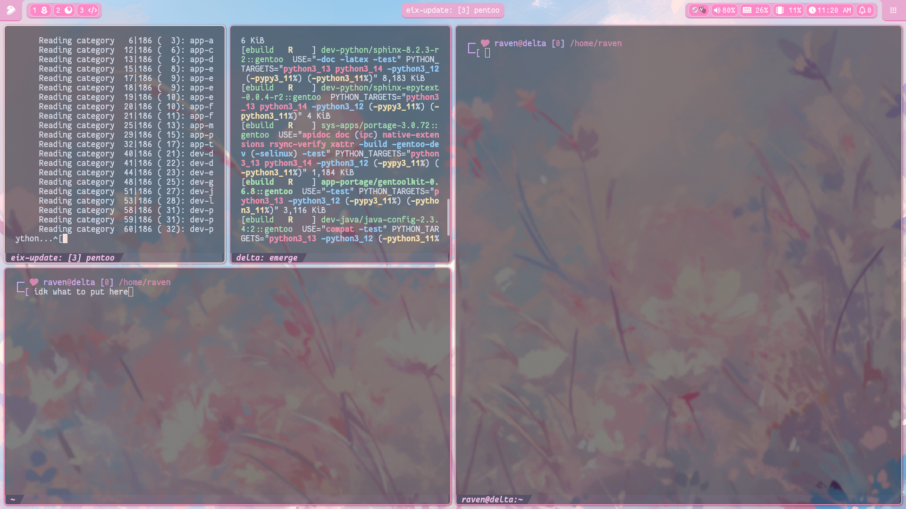

# Table of Contents:
- [Snaily's Dotfiles](#snailys-dotfiles)
- [Showcases](#showcases)
- [Issues](#⚠️-issues)
- [Dependencies](#dependencies)
- [Setup](#setup)
- [Added/Changed Shortcuts](#addedchanged-shortcuts)
- [Q&A](#qa)
- [Credits](#credits)

# Snaily's Dotfiles:
Dotfiles that I randomly worked on whenever I woke up in the middle of the night. \
I made this on SwayFX, not sure how well Waybar integrates towards other compositors.

# Showcases:
<video controls>
    <source src="vid/preview.mp4">
</video>

❤️  Music by [Aaron Cherof - Watcher](https://youtu.be/CcAV71mXg_8).

<h3>Screenshots:</h3>

    
<big>Blue</big>

    </img>

    
<big>Pink</big>

    </img>

    
<big>Green</big>

    </img>

    
<big>Coffee</big>

    </img>

    
<big>Monochromatic Light</big>

    </img>

    
<big>Monochromatic Dark</big>

    </img>

# ⚠️ Issues:
1. Waybar keeps crashing swaylock, and I don't know why. The scripts work just fine when I try them through the terminal.
2. Scrolling up/down at the edge of grouped modules crashes waybar, seems like a bug.
3. Hibernate doesn't work on OpenRC (by default?).

# Dependencies:
Made using these versions or higher.

Waybar:
> waybar-0.14.0 \
> bash-5.3_p3-r3 \
> python-3.14.0 \
> swaylock-1.8.0 \
> swaync-0.12.2 \
> nerdfonts-3.4.0 \
> fuzzel-1.13.0

Optional:
> kitty-0.43.1 \
> swaybg-1.2.1 OR mpvpaper-1.8 \
> grimshot (version unspecified)

# Setup
1. `git clone `
2. ``
3. ``
4. ``

# Added/Changed Shortcuts:
This is how I personally use Sway.
|Command|Shortcut|Description|
|-------|--------|-----------|
|Screenshot copy|$mod + Shift + S|Copies the screenshot.|
|Screenshot save|$mod + Shift + Ctrl + S|Saves the screenshot to `~/Pictures` (Modifiable in config.)|
|Restart Waybar|$mod + Shift + W|`pkill`s and launches Waybar again.|
|Lock screen|$mod + Shift + P|Locks the screen.|
|Volume control (5%)|$mod + {f10,f11,f12}|{mutes, lowers, raises} the volume by 5%.|
|Fullscreen Popups|$mod + Shift + F|If popups don't show while on fullscreen, this may fix it.|

# Q&A
### Q1. How do I change Waybar colors?
`@defined-colors` in the `waybar/style.css` file, the variables use RGB or RGBA.

# Credits
* [Tela Icon Theme](https://www.gnome-look.org/p/1279924) - The Icon pack I used for fuzzel.
* [os_release by chef (Github)](https://github.com/chef/os_release) - A list of os_release files, helped me create the simple OS display script.
* [Catppuccin Kitty (Github)](https://github.com/catppuccin/kitty) - Kitty terminal uses this theme, full credit to Catppuccin!
* [Sway (Gentoo Wiki)](https://wiki.gentoo.org/wiki/Sway) - Helped me solve screensharing issues.
* [Jeroen Knol on Medium](https://itnext.io/how-to-make-a-fancy-inverted-border-radius-in-css-5db048a53f95) - Helped me on how to make the inverted borders.
* [Nazarii Semeniuk](https://nazarii-semeniuk.com/tutorials/pure-css-shine-animation/) - Helped me on how to make the shine animations.

Wallpapers used, I am not sure of the authenticity of the sources:
* [Blue Wallpaper](https://wallpapersafari.com/w/jDn05v)
* [Pink Wallpaper](https://wallpapers-clan.com/desktop-wallpapers/pink-flowers-blue-sky-pastel/)
* [Green Wallpaper](https://getwallpapers.com/wallpaper/full/5/7/9/1150211-forest-wallpaper-hd-1920x1080-windows-7.jpg)
* [Coffee Wallpaper](https://wallpaperscraft.com/download/coffee_book_windowsill_130911/1920x1080)
* [Monochromatic Light Wallpaper](https://www.wallpaper.cam/2023/08/pixelated-monochrome-reflection-arch.html)
* [Monochromatic Dark Wallpaper](https://wallpapercave.com/w/wp11204844)

#### ❤️ And thank you for using my configuration(s)!