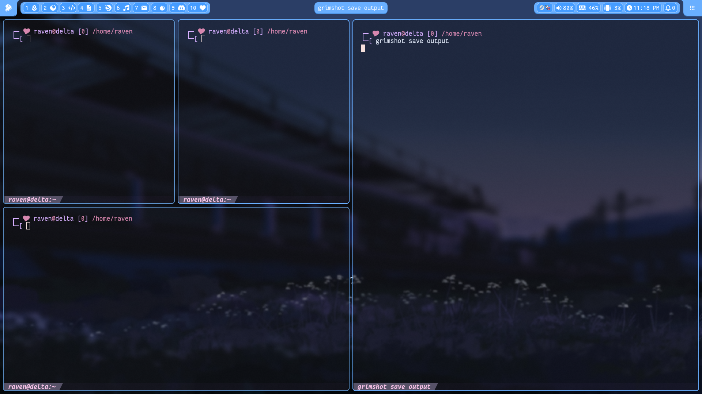
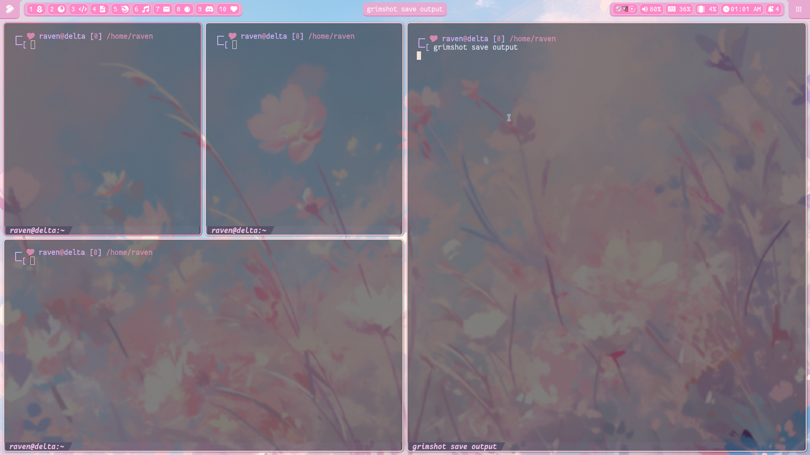
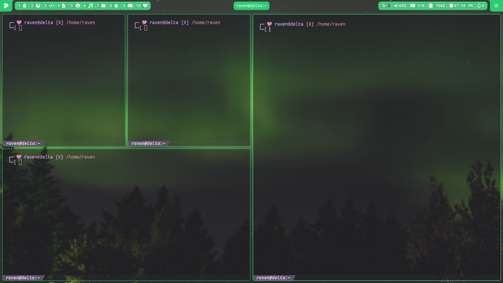
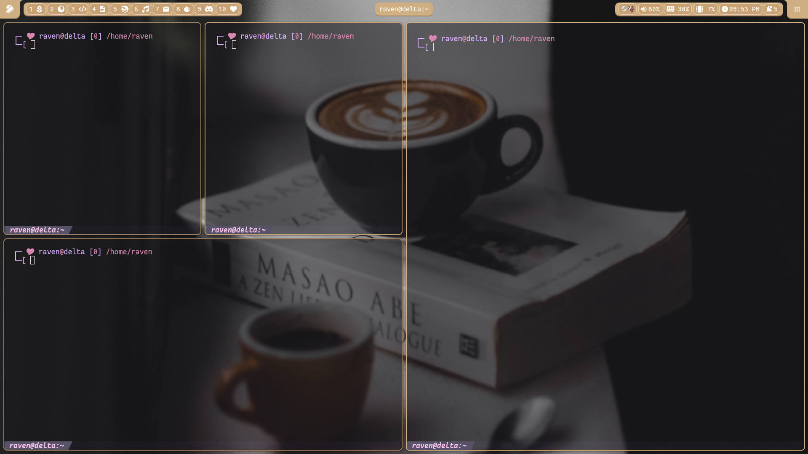
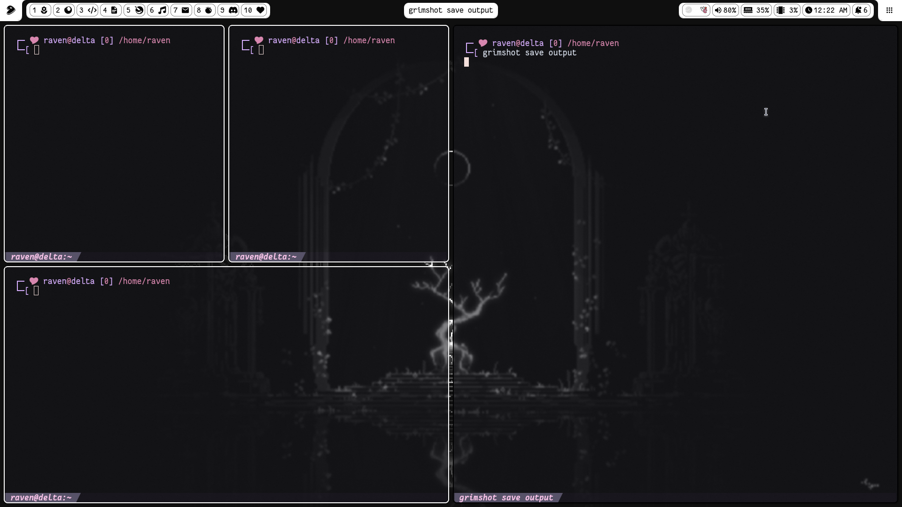
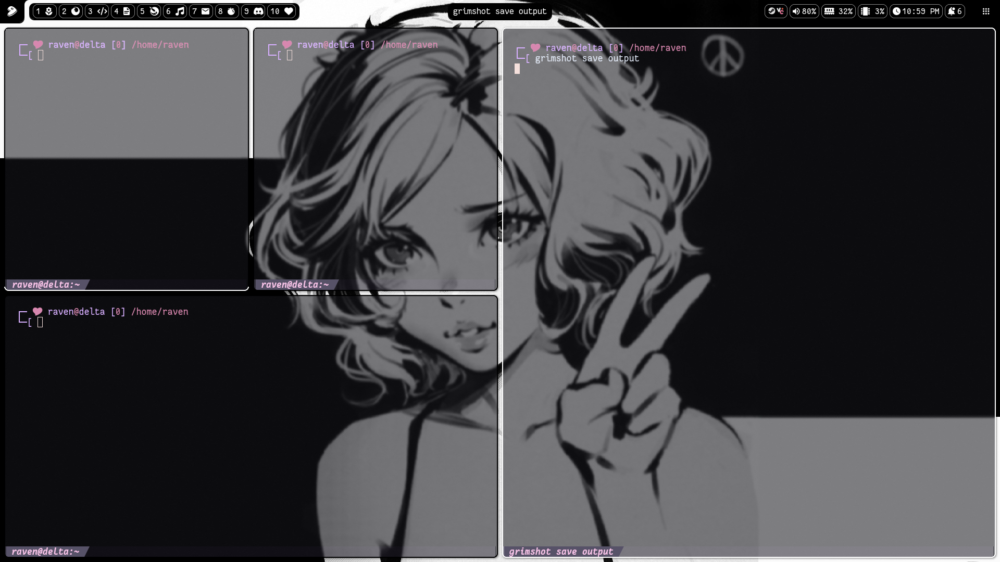

# Table of Contents:
- [Snaily's Dotfiles](#snailys-dotfiles)
- [Showcases](#showcases)
- [Issues](#issues)
- [Dependencies](#dependencies)
- [Setup](#setup)
- [Sway Keybinds](#sway-keybinds)
- [Q&A](#qa)
- [Credits](#credits)

# Snaily's Dotfiles:
Dotfiles that I randomly worked on whenever I woke up in the middle of the night. \
I made this on SwayFX, not sure how well Waybar integrates towards other compositors.

# Showcases:
https://github.com/user-attachments/assets/168793e6-ca4d-447a-a36d-b68a4b3683b3

### ❤️  Music by [unnamed planet by cephalo](https://youtu.be/3jLzzHcbktY).

<h3>Screenshots:</h3>

    
<big>Blue</big>

    </img>

    
<big>Pink</big>

    </img>

    
<big>Green</big>

    </img>

    
<big>Coffee</big>

    </img>

    
<big>Light</big>

    </img>

    
<big>Dark</big>

    </img>

# Issues:
1. Scrolling up/down at the edge of grouped modules crashes waybar, seems like a bug.
2. Hibernate doesn't work on OpenRC...
3. `swayidle` segfaults waybar after turning off display. (WHY??)

# Dependencies:
Made using these versions or higher.

> waybar-0.14.0 \
> bash-5.3_p3-r3 \
> swaylock-1.8.0 \
> swaync-0.12.2 \
> Fantasque Mono, nerdfonts-3.4.0 \
> fuzzel-1.13.0

Optional:
> kitty-0.43.1 \
> swaybg-1.2.1 OR mpvpaper-1.8 \
> grimshot

# Setup
> [!WARNING]
> * Make sure your .config files are backed up if there are existing configurations.
> * `scripts` has to be in `$HOME/.local/share/snaily-dotfiles/`
1. `git clone https://github.com/snaillyy/snaily-dotfiles`
2. `mkdir -p ~/.local/share/snaily-dotfiles`
3. `cd snaily-dofiles/src`
4. `cp -r .local/share/snaily-dotfiles ~/.local/share/`
5. Copy the directories inside the theme (example: `cp -r blue/* ~/.config/`)
6. I hope you like it!

# Sway Keybinds:
This is how I personally use Sway, I tried to make the config as modifiable as possible.
|Command|Shortcut|Description|
|-------|--------|-----------|
|Screenshot copy|$mod + Shift + S|Copies the screenshot.|
|Screenshot save|$mod + Shift + Ctrl + S|Saves the screenshot to `~/Pictures` (Modifiable in config.)|
|Restart Waybar|$mod + Shift + W|`pkill`s and launches Waybar again.|
|Lock screen|$mod + Shift + P|Locks the screen.|
|Volume control (5%)|$mod + {f10,f11,f12}|{mutes, lowers, raises} the volume by 5%.|
|Fullscreen Popups|$mod + Shift + F|Fixes missing window popups when in fullscreen mode.|

# Q&A
### Q1. Changing Waybar colors?
`@defined-colors` in the `path/to/waybar/style.css` file, the variables use RGB or RGBA.

### Q2. How can I change the calendar colors?
`path/to/sway/config` look for the `calendar` format and change the `color=XXXXXX` as you like.

### Q3. How do I change Sway's window tab colors?
`path/to/sway/themes/.../colors`, replace the dots with the color scheme chosen.

### Q4. How do I change wallpapers?
By default they're set to `~/.local/share/snaily-dotfiles/wallpaper/foo.jpg` \
There are two files one variable: \
~/.config/sway/config: `$wp1` \
~/.config/waylock/config: `image`

### Q5. Waybar looks smaller than the images posted?
A module is missing, most likely the workspaces; if that's the case take a look at `path/to/waybar/config.json` and verify that the compositor is using the correct module.\
The default uses Sway's workspaces.

### Q6. What terminal are you using?
I'm using [Kitty Terminal](https://github.com/kovidgoyal/kitty) with [Catppuccin](https://github.com/catppuccin/kitty)'s config.

### Q7. Why did this take you so long to make?
... My username explains a lot.

# Credits
* [Tela Icon Theme](https://www.gnome-look.org/p/1279924) - The Icon pack I used for fuzzel.
* [os_release by chef (Github)](https://github.com/chef/os_release) - A list of os_release files, helped me create the simple OS display script.
* [Catppuccin Kitty (Github)](https://github.com/catppuccin/kitty) - Kitty terminal uses this theme, full credit to Catppuccin!
* [Sway (Gentoo Wiki)](https://wiki.gentoo.org/wiki/Sway) - Helped me solve screensharing issues.
* [Jeroen Knol on Medium](https://itnext.io/how-to-make-a-fancy-inverted-border-radius-in-css-5db048a53f95) - Helped me on how to make the inverted borders.
* [HTML Color Codes](https://htmlcolorcodes.com/) - Who needs color theory anyways? (I used this to mix and match.)

Wallpapers used, I am not sure of the authenticity of the sources:
* [Blue Wallpaper](https://wallhaven.cc/w/gwj213)
* [Pink Wallpaper](https://wallpapers-clan.com/desktop-wallpapers/pink-flowers-blue-sky-pastel/)
* [Green Wallpaper](https://wallpaperscraft.com/download/northern_lights_aurora_starry_sky_123509/1920x1080)
* [Coffee Wallpaper](https://wallpaperscraft.com/download/coffee_book_windowsill_130911/1920x1080)
* [Light Wallpaper](https://www.wallpaper.cam/2023/08/pixelated-monochrome-reflection-arch.html)
* [Dark Wallpaper](https://wallpapercave.com/w/wp11204844)
* [Wallpaper used in video](https://www.wallpaper.cam/2026/01/solitary-snowy-peak-under-starry-sky-4k.html?m=0)

#### ❤️ And thank you for using my configuration(s)!
No AI was used for this silly little project, I spent all of my budget writing the README file.
